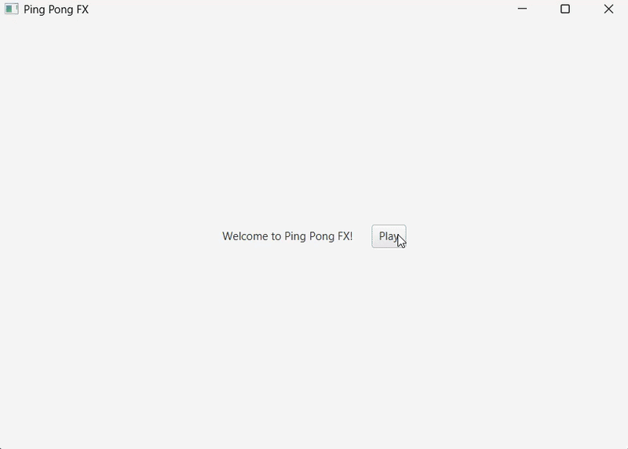

# Simple Ping Pong Game in Java

A basic **Ping Pong (Pong) game** built in Java using **JavaFX** library. This game features two-player mode where players control paddles to hit the ball back and forth.

## Features

- Two-player gameplay
- Smooth ball and paddle movement
- Simple scoring system
- Keyboard controls and mouse

## Controls

- **Player Left:**  
  - `Arrow UP` → Move paddle up  
  - `Arrow DOWN` → Move paddle down  

- **Player Right:**  
  - `Mouse` → Click and grab paddle to move it around 

### 1. Clone the repository
`git clone https://github.com/KacperHoffman/PingPongFX.git
cd PingPongFX`
### 2. Compile the project
`javac --module-path /path/to/javafx/lib --add-modules javafx.controls,javafx.fxml *.java`
### 3. Run the game
`java --module-path /path/to/javafx/lib --add-modules javafx.controls,javafx.fxml Main`

### Tips
- Replace /path/to/javafx/lib with your actual JavaFX SDK path
- If you're using an IDE (like IntelliJ or Eclipse), just run the Main class
